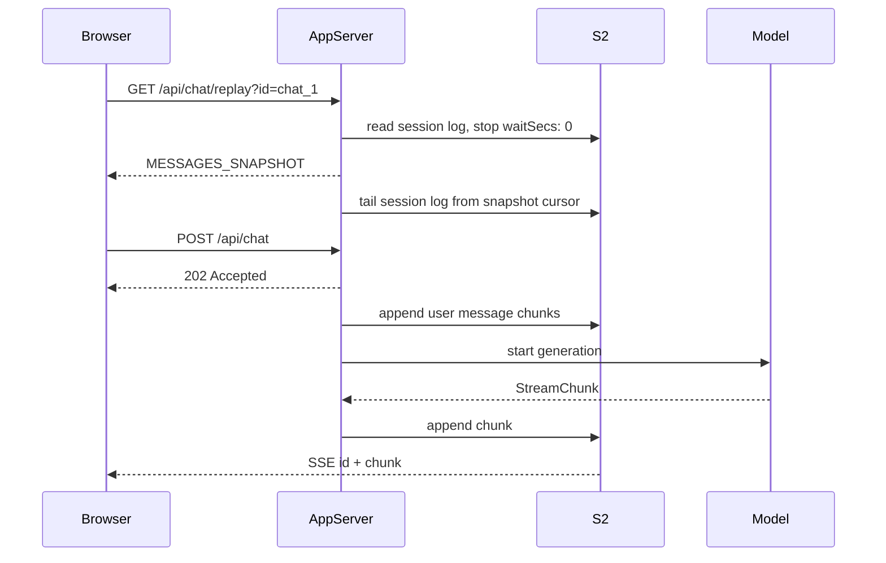

# Building Durable TanStack AI Chat Apps

This guide shows how to build a TanStack AI chat app that survives refreshes
and disconnects, and keeps multiple tabs in sync. The example app uses
TanStack Start, but the same server/client shape works in any framework that
can expose HTTP routes.

The flow is:

- TanStack AI emits `StreamChunk` objects while the model is generating.
- `@s2-dev/resumable-stream/tanstack-ai` writes those chunks to an S2 stream.
- The browser still reads through standard TanStack `useChat` APIs.
- On refresh, the app reconnects to the durable replay stream, which first
  emits current chat state and then keeps tailing.

## Refreshing Without Losing State

The simplest chat shape is a streamed `POST`: the browser sends a message and
renders chunks from that same response. That works until the page refreshes,
the network drops, or another tab opens the same chat. At that point the
browser has lost the response it was reading from, even though the generation
may still be running.

S2 makes model output durable, but the client still needs a clean way to
rebuild TanStack's UI state before it starts listening for new chunks. Session
mode handles that in the replay route: a subscription without a cursor first
receives a TanStack `MESSAGES_SNAPSHOT`, then keeps a live read open for
anything written after that snapshot.

In session mode, chat delivery is split into two responsibilities:

- A `send` request starts work.
- A live subscription receives chunks.

The example maps those responsibilities to two routes:

- `POST /api/chat` starts and persists the generation, then returns `202`.
- `GET /api/chat/replay` tails the durable session stream and owns delivery.



On reload, the UI receives everything already persisted as one snapshot chunk,
then the same subscription continues from that snapshot cursor.

## Pick A Mode

Use `mode` to choose how generations map to S2 streams.

| Mode | Use When | Refresh Behavior | Separate Snapshot Route |
| --- | --- | --- | --- |
| `single-use` | One stream per assistant turn | Replays only the active turn | No |
| `shared` | Reusing one stream for the active generation | Replays the active generation after lease/fence coordination | No |
| `session` | Full chat sessions, multiple tabs, mid-generation refresh | Replay bootstraps a snapshot, then tails later chunks | No |

For most TanStack chat apps, use `session`.

The runnable example keeps new `single-use` and `shared` sends on the POST
response path so they start rendering immediately. On refresh, the client loads
completed history first; if that history shows an active turn, it attaches the
replay route to recover that generation. In `session`, the client loads a
snapshot from the replay route, then tails the session stream from that cursor.

## Server Helper

Create one resumable chat helper for your app. Keep the server and client
`mode` values aligned.

```ts
// src/server/s2-chat.ts
import { createResumableChat } from "@s2-dev/resumable-stream/tanstack-ai";

export const chat = createResumableChat({
  accessToken: process.env.S2_ACCESS_TOKEN!,
  basin: process.env.S2_BASIN!,
  endpoints:
    process.env.S2_ACCOUNT_ENDPOINT || process.env.S2_BASIN_ENDPOINT
      ? {
          account: process.env.S2_ACCOUNT_ENDPOINT,
          basin: process.env.S2_BASIN_ENDPOINT,
        }
      : undefined,
  mode: "session",
});
```

Use a stable stream name per chat. Keep it deterministic and validate user
input before interpolating it.

```ts
const CHAT_ID_PATTERN = /^[a-zA-Z0-9_-]{1,64}$/;

function isValidChatId(value: unknown): value is string {
  return typeof value === "string" && CHAT_ID_PATTERN.test(value);
}

function streamName(chatId: string): string {
  return `tanstack-ai-chat-${chatId}`;
}
```

## Send Route

In session mode, the POST route starts generation, persists chunks, and
returns quickly. The replay subscription is the chunk delivery path.

```ts
// POST /api/chat
import { chat as tanstackChat } from "@tanstack/ai";
import { openaiText } from "@tanstack/ai-openai";
import {
  getLatestUserText,
  toTextMessages,
} from "@s2-dev/resumable-stream/tanstack-ai";
import { chat } from "./s2-chat";

export async function POST(req: Request): Promise<Response> {
  const body = await req.json();
  if (!isValidChatId(body.id)) {
    return new Response("Missing or invalid id", { status: 400 });
  }

  if (!getLatestUserText(body.messages)) {
    return new Response("Expected at least one user message", { status: 400 });
  }

  return chat.makeSessionResponse(streamName(body.id), {
    messages: body.messages,
    source: (currentMessages) =>
      tanstackChat({
        adapter: openaiText(process.env.OPENAI_MODEL ?? "gpt-4o-mini"),
        messages: toTextMessages(currentMessages),
      }),
    // In serverless runtimes, pass waitUntil/after so persistence can outlive
    // the returned 202 response.
    // waitUntil,
  });
}
```

Helper responsibilities:

- `toTextMessages` converts messages to the text-only shape many model adapters
  expect.
- `makeSessionResponse` keeps the S2 log authoritative, stores only the latest
  new user message, then stores model chunks and returns `202`.

Refresh and reconnect read from the session stream.

## Replay Route

The replay route tails the session stream. It accepts a `from` cursor supplied
by the client.

```ts
// GET /api/chat/replay?id=chat_1&from=123
import { chat } from "./s2-chat";

function parseFromSeqNum(value: string | null): number | undefined {
  if (value === null) return undefined;
  const parsed = Number.parseInt(value, 10);
  return Number.isSafeInteger(parsed) && parsed >= 0 ? parsed : undefined;
}

export async function GET(req: Request): Promise<Response> {
  const url = new URL(req.url);
  const id = url.searchParams.get("id");
  if (!isValidChatId(id)) {
    return new Response("Missing id query parameter", { status: 400 });
  }

  return chat.replay(streamName(id), {
    fromSeqNum: parseFromSeqNum(url.searchParams.get("from")),
  });
}
```

Replay responses include SSE `id` fields. The client adapter reads those ids and
advances its reconnect cursor, so a later reconnect does not duplicate already
applied chunks.

## Client Setup

On the client, pass the send and replay endpoints to the connection. In session
mode, the first replay request has no cursor, so the server sends a
`MESSAGES_SNAPSHOT` first and then tails from that snapshot cursor.

```tsx
import { createS2Connection } from "@s2-dev/resumable-stream/tanstack-ai/client";
import { useChat, type UIMessage } from "@tanstack/ai-react";
import { useMemo } from "react";

function renderText(message: UIMessage): string {
  return message.parts
    .filter(
      (part): part is { type: "text"; content: string } =>
        part.type === "text" && typeof part.content === "string",
    )
    .map((part) => part.content)
    .join("");
}

function Chat({ chatId }: { chatId: string }) {
  const connection = useMemo(
    () =>
      createS2Connection({
        mode: "session",
        sendUrl: "/api/chat",
        subscribeUrl: `/api/chat/replay?id=${encodeURIComponent(chatId)}`,
        body: { id: chatId },
      }),
    [chatId],
  );

  const chat = useChat({
    connection,
    live: true,
  });

  return (
    <form
      onSubmit={(event) => {
        event.preventDefault();
        const form = event.currentTarget;
        const input = new FormData(form).get("message");
        if (typeof input === "string" && input.trim()) {
          chat.sendMessage(input.trim());
          form.reset();
        }
      }}
    >
      {chat.messages.map((message) => (
        <article key={message.id}>{renderText(message)}</article>
      ))}
      <input name="message" />
      <button disabled={chat.isLoading || chat.sessionGenerating}>Send</button>
    </form>
  );
}
```

Key client options:

- `subscribeUrl` is both the bootstrap read and the live replay stream.
- `live: true` tells `useChat` to call `connection.subscribe()` on mount.
  Session mode uses this so refresh can reattach to an active generation.
- `body: { id: chatId }` adds the chat id to the send request.

## Refresh Flow

1. The browser reloads.
2. `useChat` starts `connection.subscribe()`.
3. `chat.replay` reads the durable session stream and emits `MESSAGES_SNAPSHOT`.
4. `chat.replay` tails the same stream from the snapshot cursor.
5. `createS2Connection` advances the cursor from SSE `id` fields.
6. Any chunks written after the snapshot arrive over the live subscription.

This avoids both common failure modes:

- No blank chat while a generation is in progress.
- No duplicate assistant text after reconnecting.

## Message Shape

`makeSessionResponse` stores the chat as TanStack stream events. For a send, it
compares the submitted `messages` with S2, adds the latest new user message as
`TEXT_MESSAGE_*` chunks, and then adds the model chunks. Session replay
rebuilds UI messages from those stored events.

Only `toTextMessages` narrows messages to text. That is just for model adapters
that expect `{ role, content }` messages. In session mode, prefer a `source`
factory so the model call receives the messages rebuilt from S2 plus the new
user message.

## Error Handling

If the model stream throws, `createResumableChat` writes a TanStack `RUN_ERROR`
chunk to the durable stream. Snapshot reconstruction appends the error text to
the relevant assistant message when possible.

For production, prefer a custom `onError` message:

```ts
const chat = createResumableChat({
  accessToken: process.env.S2_ACCESS_TOKEN!,
  basin: process.env.S2_BASIN!,
  mode: "session",
  onError: () => "The model stopped unexpectedly.",
});
```

## Production Notes

- Validate chat ids before deriving stream names.
- Configure the S2 basin to create streams on append/read.
- Use one stable stream name per session chat.
- Pass `waitUntil` or your platform equivalent in serverless runtimes.
- Keep server and client `mode` values the same.
- In session mode, let replay bootstrap without a `from` cursor on first mount.
- Use `live: true` when replay should start on mount.
- Use HTTPS and normal application auth around chat endpoints.

## Run The Example

With S2 Lite:

```bash
export S2_ACCOUNT_ENDPOINT=http://localhost:8080
export S2_BASIN_ENDPOINT=http://localhost:8080
export S2_ACCESS_TOKEN=ignored
export S2_BASIN=my-basin

bun run example:tanstack-ai-chat
```

Open the URL printed by the dev server.

Without `OPENAI_API_KEY`, the app uses a deterministic local stream so refresh
behavior can be tested without a model provider. To use real TanStack AI
generation:

```bash
export OPENAI_API_KEY=sk-...
export OPENAI_MODEL=gpt-4o-mini
bun run example:tanstack-ai-chat
```

## Example Files

- `src/routes/index.tsx`: React chat UI and `useChat`.
- `src/routes/api.chat.ts`: starts a generation.
- `src/routes/api.chat.replay.ts`: streams session chunks or the active
  non-session turn.
- `src/routes/api.chat.history.ts`: compatibility endpoint for non-session modes.
- `src/server/chat.ts`: stream names, S2 helper setup, and model stream creation.

## Troubleshooting

If a refresh shows an empty chat during generation:

- In `session`, confirm the client uses `live: true`, the replay route calls
  `chat.replay`, and the send route uses `makeSessionResponse`.
- In `single-use` or `shared`, confirm the client loads history first and uses
  replay on mount when the history has an unmatched user turn.
- Confirm the replay route can identify the active stream before returning
  `204`.

If assistant text duplicates after reconnect:

- Confirm replay responses include SSE `id` fields. `chat.replay(...)` handles
  this when replay is the delivery path.
- Confirm no fixed `from` value is baked into `subscribeUrl` after mount.

If POST requests stay open until generation finishes:

- Confirm session sends use `makeSessionResponse`, not `makeResumable`.
- Confirm the client uses `mode: "session"`.

If messages lose ids:

- Pass the normal TanStack `messages` array to `makeSessionResponse`.
- Only use `toTextMessages(messages)` for the model adapter input.
