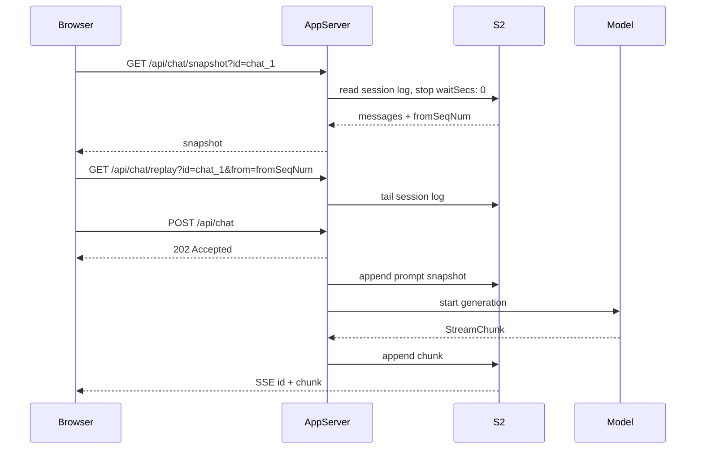

# Building TanStack AI Chat Apps With S2 Resume

This guide explains how to build a TanStack AI chat app whose generations
survive refreshes, disconnects, and multiple open tabs. The example app is a
TanStack Start chat client, but the same server/client shape works in any
framework that can expose HTTP routes.

The core idea is simple:

- TanStack AI emits `StreamChunk` objects while the model is generating.
- `@s2-dev/resumable-stream/tanstack-ai` writes those chunks to an S2 stream.
- The browser reads from normal TanStack `useChat` APIs.
- On refresh, the app first loads a snapshot, then reconnects to the durable
  stream from the exact next S2 sequence number.

## Why Shared-Live Exists

TanStack AI has two useful ways to think about chat delivery:

- A `send` request starts work.
- A live subscription receives chunks.

`streamReuse: "shared-live"` maps that cleanly to S2:

- `POST /api/chat` starts and persists the generation, then returns `202`.
- `GET /api/chat/replay` tails the durable session stream and owns delivery.
- `GET /api/chat/snapshot` reads the durable stream with `waitSecs: 0` and
  returns the current UI messages plus the next sequence number.



The snapshot step is what prevents the "blank mid-generation after refresh"
case. The UI renders everything already persisted, then the replay subscription
continues from `fromSeqNum`.

## Choosing A Mode

Use `streamReuse` to choose the durability shape.

| Mode | Best For | Refresh Behavior | Snapshot Needed |
| --- | --- | --- | --- |
| `single-use` | One stream per assistant turn | Replays only the active turn | No |
| `shared` | Reusing one stream for the active generation | Replays the active generation after lease/fence coordination | No |
| `shared-live` | Full chat sessions, multiple tabs, mid-generation refresh | Snapshot first, then tail new chunks forever | Yes |

For most TanStack chat apps, use `shared-live`.

## Server Setup

Create one resumable chat helper for your app. Keep `streamReuse` aligned with
the client `mode`.

```ts
// src/server/s2-chat.ts
import { createResumableChat } from "@s2-dev/resumable-stream/tanstack-ai";

export const chat = createResumableChat({
  accessToken: process.env.S2_ACCESS_TOKEN!,
  basin: process.env.S2_BASIN!,
  endpoints:
    process.env.S2_ACCOUNT_ENDPOINT || process.env.S2_BASIN_ENDPOINT
      ? {
          account: process.env.S2_ACCOUNT_ENDPOINT,
          basin: process.env.S2_BASIN_ENDPOINT,
        }
      : undefined,
  streamReuse: "shared-live",
});
```

Use a stable stream name per chat. Keep it deterministic and validate user
input before interpolating it.

```ts
const CHAT_ID_PATTERN = /^[a-zA-Z0-9_-]{1,64}$/;

function isValidChatId(value: unknown): value is string {
  return typeof value === "string" && CHAT_ID_PATTERN.test(value);
}

function streamName(chatId: string): string {
  return `tanstack-ai-chat-${chatId}`;
}
```

## Start A Generation

In shared-live mode, the send route should not stream chunks back on the POST
response. It should start the generation and let the replay subscription deliver
chunks.

```ts
// POST /api/chat
import { chat as tanstackChat } from "@tanstack/ai";
import { openaiText } from "@tanstack/ai-openai";
import {
  getLatestUserText,
  normalizeMessages,
  toTextMessages,
} from "@s2-dev/resumable-stream/tanstack-ai";
import { chat } from "./s2-chat";

export async function POST(req: Request): Promise<Response> {
  const body = await req.json();
  if (!isValidChatId(body.id)) {
    return new Response("Missing or invalid id", { status: 400 });
  }

  const messages = normalizeMessages(body.messages);
  if (!getLatestUserText(messages)) {
    return new Response("Expected at least one user message", { status: 400 });
  }

  const source = tanstackChat({
    adapter: openaiText(process.env.OPENAI_MODEL ?? "gpt-4o-mini"),
    messages: toTextMessages(messages),
  });

  return chat.makeSessionResponse(streamName(body.id), {
    messages,
    source,
    // In serverless runtimes, pass waitUntil/after so persistence can outlive
    // the returned 202 response.
    // waitUntil,
  });
}
```

What the helpers do:

- `normalizeMessages` preserves TanStack UI message ids and non-text parts.
- `toTextMessages` converts messages to the text-only shape many model adapters
  expect.
- `makeSessionResponse` appends a `MESSAGES_SNAPSHOT` chunk first, then appends
  model chunks, persists everything in the background, and returns `202`.

That means the durable S2 session stream is the source of truth for refreshes.

## Replay New Chunks

The replay route tails the session stream. It accepts a `from` cursor supplied
by the client.

```ts
// GET /api/chat/replay?id=chat_1&from=123
import { chat } from "./s2-chat";

function parseFromSeqNum(value: string | null): number | undefined {
  if (value === null) return undefined;
  const parsed = Number.parseInt(value, 10);
  return Number.isSafeInteger(parsed) && parsed >= 0 ? parsed : undefined;
}

export async function GET(req: Request): Promise<Response> {
  const url = new URL(req.url);
  const id = url.searchParams.get("id");
  if (!isValidChatId(id)) {
    return new Response("Missing id query parameter", { status: 400 });
  }

  return chat.replay(streamName(id), {
    fromSeqNum: parseFromSeqNum(url.searchParams.get("from")),
  });
}
```

Replay responses include SSE `id` fields. The client adapter reads those ids and
advances its reconnect cursor, so a later reconnect does not duplicate already
applied chunks.

## Load A Snapshot

The snapshot route reconstructs UI messages from the durable session stream and
returns `{ messages, fromSeqNum }`.

```ts
// GET /api/chat/snapshot?id=chat_1
import { chat } from "./s2-chat";

export async function GET(req: Request): Promise<Response> {
  const id = new URL(req.url).searchParams.get("id");
  if (!isValidChatId(id)) {
    return new Response("Missing id query parameter", { status: 400 });
  }

  return chat.getSessionSnapshotResponse(streamName(id));
}
```

Internally this is a bounded read using `waitSecs: 0`. It does not subscribe or
block for future chunks; it only answers "what is already durable right now?"

## Client Setup

On the client, load the snapshot before creating the connection.

```tsx
import {
  createS2Connection,
  loadSnapshot,
  type ChatSnapshot,
} from "@s2-dev/resumable-stream/tanstack-ai/client";
import { useChat, type UIMessage } from "@tanstack/ai-react";
import { useEffect, useMemo, useState } from "react";

function renderText(message: UIMessage): string {
  return message.parts
    .filter(
      (part): part is { type: "text"; content: string } =>
        part.type === "text" && typeof part.content === "string",
    )
    .map((part) => part.content)
    .join("");
}

function Chat({ chatId }: { chatId: string }) {
  const [snapshot, setSnapshot] = useState<ChatSnapshot | null>(null);

  useEffect(() => {
    loadSnapshot({ url: `/api/chat/snapshot?id=${encodeURIComponent(chatId)}` })
      .then(setSnapshot)
      .catch(() => setSnapshot({ messages: [], fromSeqNum: 0 }));
  }, [chatId]);

  if (!snapshot) return null;

  return <ChatInner chatId={chatId} snapshot={snapshot} />;
}

function ChatInner({
  chatId,
  snapshot,
}: {
  chatId: string;
  snapshot: ChatSnapshot;
}) {
  const connection = useMemo(
    () =>
      createS2Connection({
        mode: "shared-live",
        sendUrl: "/api/chat",
        subscribeUrl: `/api/chat/replay?id=${encodeURIComponent(chatId)}`,
        snapshot,
        body: { id: chatId },
      }),
    [chatId, snapshot],
  );

  const chat = useChat({
    connection,
    initialMessages: snapshot.messages,
    live: true,
  });

  return (
    <form
      onSubmit={(event) => {
        event.preventDefault();
        const form = event.currentTarget;
        const input = new FormData(form).get("message");
        if (typeof input === "string" && input.trim()) {
          chat.sendMessage(input.trim());
          form.reset();
        }
      }}
    >
      {chat.messages.map((message) => (
        <article key={message.id}>{renderText(message)}</article>
      ))}
      <input name="message" />
      <button disabled={chat.isLoading || chat.sessionGenerating}>Send</button>
    </form>
  );
}
```

The important pieces are:

- `initialMessages: snapshot.messages` renders durable state immediately.
- `snapshot` seeds the first replay cursor.
- `live: true` keeps TanStack subscribed after mount.
- `body: { id: chatId }` adds the chat id to the send request.

## What Happens On Refresh

1. The browser reloads.
2. The page calls `loadSnapshot`.
3. The server reads the durable S2 stream and returns the latest UI messages.
4. The page renders those messages as `initialMessages`.
5. `createS2Connection` starts replay from `snapshot.fromSeqNum`.
6. Any chunks written after the snapshot arrive over the live subscription.

This avoids both failure modes:

- No blank chat while a generation is in progress.
- No duplicate assistant text after reconnecting.

## Preserving Rich Messages

`makeSessionResponse` stores the full UI messages you pass in `messages`. That
preserves:

- existing TanStack message ids,
- stable React keys,
- non-text parts such as files or tool-related parts,
- the latest user prompt before the assistant response starts.

Only `toTextMessages` narrows messages to text, and that is just for model
adapters that expect `{ role, content }` messages. The durable snapshot still
keeps the richer UI shape.

## Error Handling

If the model stream throws, `createResumableChat` writes a TanStack `RUN_ERROR`
chunk to the durable stream. Snapshot reconstruction appends the error text to
the relevant assistant message when possible.

For production, prefer a custom `onError` message:

```ts
const chat = createResumableChat({
  accessToken: process.env.S2_ACCESS_TOKEN!,
  basin: process.env.S2_BASIN!,
  streamReuse: "shared-live",
  onError: () => "The model stopped unexpectedly.",
});
```

## Production Checklist

- Validate chat ids before deriving stream names.
- Use one stable stream name per shared-live chat.
- Pass `waitUntil` or your platform equivalent in serverless runtimes.
- Keep server `streamReuse` and client `mode` the same.
- Load a snapshot before rendering `useChat` for shared-live.
- Pass `snapshot` to `createS2Connection`.
- Keep `live: true` for shared-live clients.
- Use HTTPS and normal application auth around chat endpoints.

## Running This Example

With S2 Lite:

```bash
export S2_ACCOUNT_ENDPOINT=http://localhost:8080
export S2_BASIN_ENDPOINT=http://localhost:8080
export S2_ACCESS_TOKEN=ignored
export S2_BASIN=my-basin

bun run example:tanstack-ai-chat
```

Open the URL printed by the dev server.

Without `OPENAI_API_KEY`, the app uses a deterministic local stream so refresh
behavior can be tested without a model provider. To use real TanStack AI
generation:

```bash
export OPENAI_API_KEY=sk-...
export OPENAI_MODEL=gpt-4o-mini
bun run example:tanstack-ai-chat
```

## Files In This Example

- `src/routes/index.tsx`: React chat UI, snapshot loading, and `useChat`.
- `src/routes/api.chat.ts`: starts a generation.
- `src/routes/api.chat.replay.ts`: tails the durable session stream.
- `src/routes/api.chat.snapshot.ts`: returns the bounded session snapshot.
- `src/routes/api.chat.history.ts`: compatibility endpoint for non-live modes.
- `src/server/chat.ts`: stream names, S2 helper setup, and model stream creation.

## Troubleshooting

If a refresh shows an empty chat during generation:

- Confirm the client calls `loadSnapshot` before constructing the connection.
- Confirm the server send route uses `makeSessionResponse`.
- Confirm the snapshot route calls `getSessionSnapshotResponse`.

If assistant text duplicates after reconnect:

- Confirm replay responses include SSE `id` fields. `chat.replay(...)` handles
  this for `shared-live`.
- Confirm the client passes the loaded `snapshot` to `createS2Connection`.
- Confirm no fixed `from` value is baked into `subscribeUrl` after mount.

If POST requests stay open until generation finishes:

- Confirm shared-live sends use `makeSessionResponse`, not `makeResumable`.
- Confirm the client uses `mode: "shared-live"`.

If messages lose ids or non-text parts:

- Pass the full TanStack UI `messages` array to `makeSessionResponse`.
- Only use `toTextMessages(messages)` for the model adapter input.
