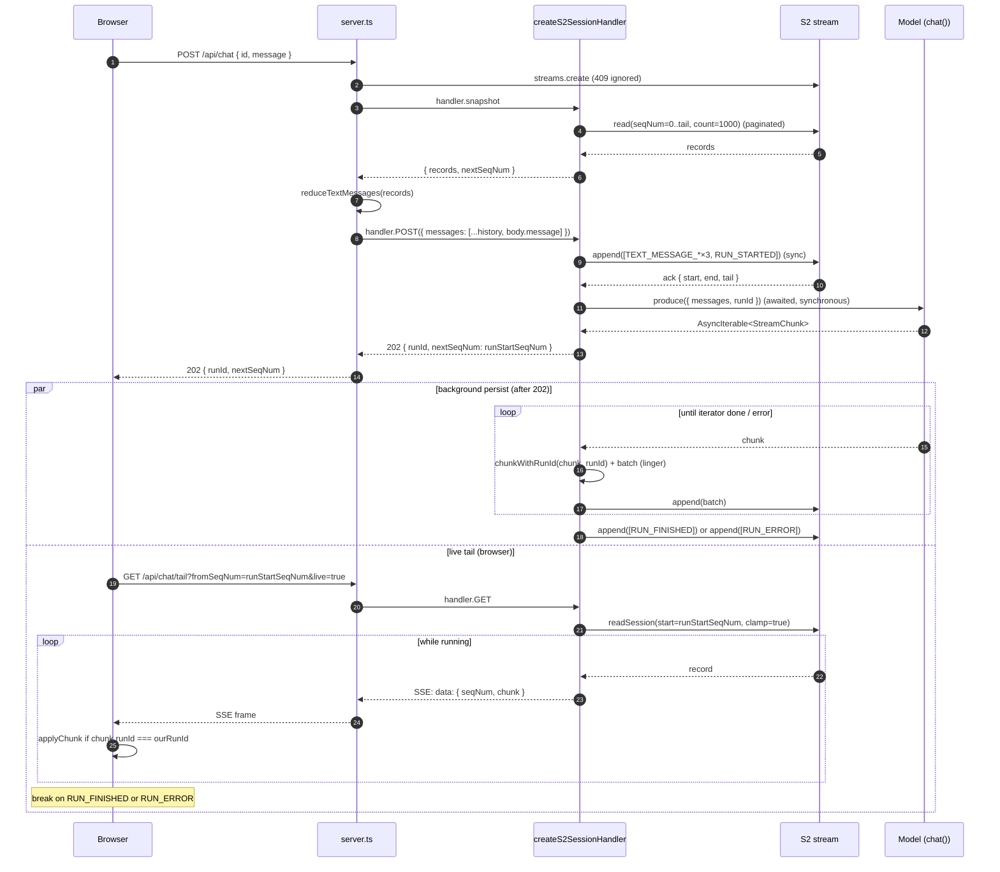

# TanStack AI integration — review path

A guided walk through each piece of functionality in `@s2-dev/resumable-stream/tanstack-ai`. Read top-to-bottom to follow execution order; jump to a section to review one path in isolation.

References use the form `<file>:<line>` against:
- `tanstack-ai.ts` → `packages/resumable-stream/src/tanstack-ai.ts`
- `server.ts` → `examples/tanstack-ai-chat/server.ts`
- `index.html` → `examples/tanstack-ai-chat/public/index.html`

---

## 0. Mental model

Two layers ship in the same module:

| Layer | Stream lifetime | Use when |
|---|---|---|
| `createResumableGeneration` (`tanstack-ai.ts:912`) | one stream per generation, single-writer fence | a single AI run needs to be resumable |
| `createS2SessionHandler` (`tanstack-ai.ts:1146`) | one stream per session, multiple runs over time | you want a durable chat backend with history |

Both persist **raw `StreamChunk`s** — no `kind`/discriminator envelope. Run boundaries are TanStack-native (`RUN_STARTED`/`RUN_FINISHED`/`RUN_ERROR`). User messages persist as `TEXT_MESSAGE_START`/`CONTENT`/`END` chunks with `role: "user"`. `runId` is injected on every persisted chunk so multi-run streams can be filtered consumer-side.

---

## 1. POST /api/chat — append a user turn, start a run

The hot path. Browser → server → S2. Two HTTP calls per turn (this one + tail in §2).

### Call hierarchy

```
[Browser]  POST /api/chat  { id, message }
   │
Bun.serve fetch                                          server.ts:293
   │  (route match)                                      server.ts:303
   ▼
handleChat(request)                                      server.ts:252
   ├── isValidChatId(body.id)                            server.ts:66
   ├── isUserMessage(body.message)                       server.ts:70
   ├── streamNameForChat(chatId)                         server.ts:51
   ├── ensureStreamExists(streamName)                    server.ts:231
   │      └── basinClient.streams.create({stream})       (catches 409)
   ├── snapshotForStream(streamName)                     server.ts:220
   │      └── handler.snapshot(streamName)               tanstack-ai.ts:1294
   │            └── materializeSessionSnapshot({stream}) tanstack-ai.ts:748
   │                  ├── records = []
   │                  ├── for await record of
   │                  │      readS2SessionRecordsFromStream({  tanstack-ai.ts:675
   │                  │        stream, fromSeqNum:0, live:false, batchSize:1000 })
   │                  │   loop until catch-up:                       (live:false branch)
   │                  │     ├── stream.read({                        tanstack-ai.ts:708
   │                  │     │     start:{from:{seqNum:N}, clamp:true},
   │                  │     │     stop:{limits:{count:1000}},
   │                  │     │     ignoreCommandRecords:true })
   │                  │     ├── catch RangeNotSatisfiable → break    tanstack-ai.ts:717
   │                  │     ├── if records.length === 0 → break
   │                  │     ├── yield each readRecordToS2SessionRecord
   │                  │     └── if nextSeqNum >= batch.tail.seqNum → break
   │                  │       records.push(record)
   │                  └── return { records, nextSeqNum: lastRec.seqNum+1 ?? fromSeqNum }
   ├── reduceTextMessages(snapshot.records)              server.ts:143
   ├── messages = [...reduced, body.message]
   │
   └── handler.POST(forwardedRequest, {waitUntil})       (delegates ↓)
         │
         ▼
createS2SessionHandler.POST                              tanstack-ai.ts:1166
   ├── parse JSON body
   ├── resolveStreamName({request, body})                tanstack-ai.ts:1047  (default)
   ├── stream = getStream(streamName)                    tanstack-ai.ts:1156  (closure binding)
   ├── messagesFromBody(body)                            tanstack-ai.ts:518   (throws Response on bad)
   ├── selectNewMessages({body, messages})               tanstack-ai.ts:561   (default = [latest])
   ├── runId = body.runId ?? `run-<random>`
   │
   ├── userChunks = newMessages.flatMap(m =>             tanstack-ai.ts:1185
   │       messageToChunks(m, {runId}))                  tanstack-ai.ts:304   (default emits 3 chunks/msg)
   ├── startChunks = [...userChunks,                     tanstack-ai.ts:1188
   │                  makeRunStartedChunk(runId)]        tanstack-ai.ts:296
   │
   ├── ack = await appendChunksToStream(stream,          tanstack-ai.ts:1193
   │             startChunks)                            tanstack-ai.ts:354
   │           └── stream.append(AppendInput.create(
   │                 chunks.map(chunkToAppendRecord)))   tanstack-ai.ts:330
   │
   ├── runStartSeqNum = ack.start.seqNum                 tanstack-ai.ts:1194
   │                    + userChunks.length
   │
   ├── try { source = await config.produce({...,         tanstack-ai.ts:1207
   │                       newMessages, runId, ...}) }
   │   catch (error) {                                   tanstack-ai.ts:1220
   │     errorAck = await appendChunksToStream(stream,   tanstack-ai.ts:1221
   │                  [makeRunErrorChunk(runId,          tanstack-ai.ts:279
   │                                     error,
   │                                     config.onError)])
   │     return appendAcceptedResponse(errorAck.tail)
   │   }
   │
   ├── persistPromise = persistS2Run({stream, runId,     tanstack-ai.ts:1227
   │                       source, batchSize,            tanstack-ai.ts:570
   │                       lingerDuration})
   │      └── for await batch of s2RunChunkBatches(...)  tanstack-ai.ts:596
   │            ├── pending.push(chunkWithRunId(         tanstack-ai.ts:656
   │            │       chunk, runId))                   tanstack-ai.ts:326
   │            ├── flush trigger:
   │            │     pending.length >= batchSize  OR
   │            │     lingerDuration timer fires  OR
   │            │     iterator done  OR
   │            │     iterator throws
   │            ├── on done   → push makeRunFinishedChunk; yield      tanstack-ai.ts:662
   │            │                                                     tanstack-ai.ts:300
   │            └── on error  → push makeRunErrorChunk;  yield;       tanstack-ai.ts:665
   │                            rethrow                               tanstack-ai.ts:667
   │      └── appendChunksToStream(stream, batch)        tanstack-ai.ts:592
   │             per yielded batch
   │
   ├── if waitUntil: options.waitUntil(persistPromise)   tanstack-ai.ts:1234
   │   else: persistPromise.catch(console.error)         tanstack-ai.ts:1238
   │
   └── return appendAcceptedResponse(ack.tail)           tanstack-ai.ts:1247
        Response.json({                                  tanstack-ai.ts:1195
          streamName, runId, startSeqNum:ack.start.seqNum,
          nextSeqNum:runStartSeqNum, tail
        }, {status:202})
```

### What to verify

- **Sync portion completes before 202**: user-message chunks + `RUN_STARTED` are appended via `appendChunksToStream` *before* the response is sent. Otherwise the client tails past records that don't yet exist.
- **`runStartSeqNum` math** (`tanstack-ai.ts:1194`): points the consumer at the `RUN_STARTED` record, not past it. Consumer's first tailed chunk is the run-boundary marker.
- **Background persist is fire-and-forget**: `waitUntil` keeps the promise alive on serverless platforms; otherwise we attach `.catch(console.error)` so a failure doesn't crash the process (`tanstack-ai.ts:1238`).
- **`produce` throw paths**: if `produce()` itself throws synchronously (`tanstack-ai.ts:1220`), we append a `RUN_ERROR` and return 202. If it returns an iterator that throws later, `s2RunChunkBatches` emits `RUN_ERROR` and rethrows (`tanstack-ai.ts:665`).
- **`runId` is injected on EVERY chunk** before persist (`chunkWithRunId`, `tanstack-ai.ts:326`), even if the model didn't include one. Consumers filter by it.

### Tests (`packages/resumable-stream/src/tests/tanstack-ai.test.ts`)

- `appends a RUN_ERROR chunk if session production fails before streaming` — produce-throws path
- `batches S2 session chunks before persisting` — sync `[4]` (3 user + RUN_STARTED), background `[2,2]` with `batchSize=2`
- `injects runId into model chunks that don't already carry one` — `chunkWithRunId` correctness
- `respects a custom messageToChunks override` — config hook
- `rejects invalid session message bodies before appending` — `messagesFromBody` validation

---

## 2. GET /api/chat/tail — live SSE of the run

```
[Browser]  fetch /api/chat/tail?id=...&fromSeqNum=runStartSeqNum&live=true
   │
Bun.serve fetch                                          server.ts:293
   │  (route match)                                      server.ts:307
   ├── isValidChatId
   └── handler.GET(rewriteTailRequest(request, chatId))  server.ts:312, 280
         │
         ▼
createS2SessionHandler.GET                               tanstack-ai.ts:1256
   ├── parseSeqNum(?fromSeqNum ?? ?offset)               tanstack-ai.ts:1135
   ├── live = (?live !== "false")
   ├── stream = getStream(streamName)
   └── jsonSseResponseFromValues(                        tanstack-ai.ts:402
         readS2SessionRecordsFromStream({                tanstack-ai.ts:675
            stream, fromSeqNum, live:true}))
                │
                ▼  (live:true branch — tanstack-ai.ts:686)
         stream.readSession({                            tanstack-ai.ts:687  (S2 streaming)
            start:{from:{seqNum:N}, clamp:true},
            ignoreCommandRecords:true })
         try {
            for await (record of session)
               yield readRecordToS2SessionRecord(rec)    tanstack-ai.ts:334
         } finally {
            session[Symbol.asyncDispose]?.()             tanstack-ai.ts:700
         }
                ▼
         sseResponseFromStrings                          tanstack-ai.ts:372
            emits  data: {"seqNum":N,"timestamp":"...","chunk":{...}}\n\n

[Browser]  readSessionEvents(response)                   index.html:248
   └── for each parsed record                            index.html:306
          ├── chunk = record.chunk                       index.html:307
          ├── if chunk.runId !== ourRunId → skip         index.html:308
          ├── applyChunk(bubble, chunk)                  index.html:228
          │      ├── TEXT_MESSAGE_CONTENT → bubble.textContent += chunk.delta
          │      └── RUN_ERROR             → bubble.textContent += "[error] ..."
          └── if chunk.type ∈ {RUN_FINISHED, RUN_ERROR}  index.html:310
              → break
```

### What to verify

- **`stream.readSession` blocks at-tail with heartbeats** (S2 spec: 5–15s). Does NOT throw 416 on empty streams.
- **runId filter is consumer-side**: server emits ALL records past `fromSeqNum`; the browser drops chunks for other runs that share the stream.
- **Both `RUN_FINISHED` and `RUN_ERROR` terminate** the consumer loop (`index.html:310`).
- **`session[Symbol.asyncDispose]` runs in `finally`** (`tanstack-ai.ts:700`) — readSession resource is released even on iterator throw.

### Tests

- `serializes session records as resumable SSE events` — wire format
- `creates an S2 session connection that appends then tails by seqNum` — round-trip via `createS2Connection`
- `filters tailed chunks by runId so other runs in the same stream are skipped`

---

## 3. GET /api/chat/snapshot — restore on page load

```
[Browser]  fetch /api/chat/snapshot?id=<chatId>
   │
Bun.serve fetch                                          server.ts:293
   │  (route match)                                      server.ts:315
   └── handleSnapshot(chatId)                            server.ts:241
         ├── snapshotForStream(streamName)               server.ts:220
         │     ├── handler.snapshot(streamName)          tanstack-ai.ts:1294
         │     │     └── materializeSessionSnapshot(...) tanstack-ai.ts:748
         │     │           ├── records = []
         │     │           ├── for await record of
         │     │           │     readS2SessionRecordsFromStream(    tanstack-ai.ts:675
         │     │           │       {stream,
         │     │           │        fromSeqNum:0,
         │     │           │        live:false,
         │     │           │        batchSize:1000})
         │     │           │
         │     │           │  ▼  (live:false branch)
         │     │           │  let nextSeqNum = fromSeqNum
         │     │           │  while (true):
         │     │           │    try {
         │     │           │      batch = await stream.read({       tanstack-ai.ts:708
         │     │           │        start:{from:{seqNum:N}, clamp:true},
         │     │           │        stop:{limits:{count:1000}},
         │     │           │        ignoreCommandRecords:true})
         │     │           │    } catch (RangeNotSatisfiable) {     tanstack-ai.ts:717
         │     │           │      break  ← cold-start safety net
         │     │           │    }
         │     │           │    if (batch.records.length === 0)     tanstack-ai.ts:722
         │     │           │      break
         │     │           │    yield each readRecordToS2SessionRecord
         │     │           │    nextSeqNum = lastRec.seqNum + 1
         │     │           │    if (nextSeqNum >= batch.tail.seqNum) tanstack-ai.ts:731
         │     │           │      break
         │     │           │
         │     │           │      records.push(record)
         │     │           ├── lastRecord = records[records.length-1]
         │     │           ├── nextSeqNum = lastRecord
         │     │           │     ? lastRecord.seqNum+1 : fromSeqNum
         │     │           └── return { records, nextSeqNum }       tanstack-ai.ts:770
         │     │
         │     └── catch isStreamNotFound  →                        server.ts:222, 79
         │           return { records:[], nextSeqNum:0 }
         │
         ├── activeRunId(snapshot.records)                          server.ts:174
         │     └── walks chunks:
         │           RUN_STARTED              → active.add(runId)
         │           RUN_FINISHED|RUN_ERROR  → active.delete(runId)
         │           any other w/ runId       → latest = runId
         │           returns latest if still in active set
         │
         ├── reduceTextMessages(snapshot.records)                   server.ts:143
         │     └── walks chunks (TEXT_MESSAGE_START/CONTENT)
         │         → ChatMessage[] grouped by messageId
         │
         └── Response.json({
               streamName,
               activeRunId,
               messages: reduced,
               ...snapshot                ← spreads {records, nextSeqNum}
             })
   │
   ▼
[Browser]  loadSnapshot()                                index.html:275
   ├── for message of snapshot.messages:
   │     addMessage(role, content)                       index.html:285
   └── if snapshot.activeRunId:
        ├── bubble = assistantBubbleForResume(snapshot)  index.html:290
        └── tailRun(activeRunId, snapshot.nextSeqNum,    index.html:301, 356
                    bubble)
            ← reuses §2 (live tail)
```

### What to verify

- **TOCTOU-safe `nextSeqNum`** (`tanstack-ai.ts:769`): derived from `lastRecord.seqNum + 1`, NOT from a separate `checkTail`. Invariant `records.length === nextSeqNum - fromSeqNum` holds even when records are appended mid-pagination.
- **Pagination handles BOTH unary caps**: 1000 records / 1 MiB per S2 unary read response. The loop exits on `nextSeqNum >= batch.tail.seqNum` (`tanstack-ai.ts:731`), NOT on `records.length < batchSize` — so a byte-truncated batch still drains correctly.
- **416 catch is for s2-lite cold-start** (`tanstack-ai.ts:717`). Real S2 with `clamp:true` returns empty `records[]` instead of erroring; the catch is harmless either way but currently fires anywhere in the pagination loop. Could be narrowed to "first batch only" if we want to surface mid-pagination range errors.
- **`isStreamNotFound`** (`server.ts:79`) string-matches `error.code === "stream_not_found"`. Brittle if the SDK ever renames; should use a typed error class once exported.
- **All records loaded into memory** (`tanstack-ai.ts:760`). Acceptable for chat-sized sessions; for huge ones (>50k chunks) consider streaming `snapshot()` as `AsyncIterable<S2SessionRecord>`.

### Tests

- `returns a session snapshot of typed records with the next seqNum`
- `keeps records.length consistent with nextSeqNum when records are appended mid-pagination`

---

## 4. `createS2Connection` — public client adapter

Not used by the chat example (the example wires `fetch` directly). For consumers that want a `Connection`-shaped object to plug into TanStack AI's transport.

```
connection.connect(messages, data?, abortSignal?)        tanstack-ai.ts:842
   │
   ├── streamName = resolveConnectionStreamName(...)     tanstack-ai.ts:486
   │
   ├── appendResponse = await fetchClient(               tanstack-ai.ts:849
   │     resolveOption(options.appendUrl),
   │     POST { messages, data, streamName })
   │     (server-side runs the entire §1 flow)
   │
   ├── if (!appendResponse.ok) → throw                   tanstack-ai.ts:861
   │
   ├── appendAck = parseS2AppendResponse(                tanstack-ai.ts:867, 528
   │     await appendResponse.json())
   │     validates {streamName, runId, nextSeqNum}
   │
   ├── fromSeqNum = options.initialSeqNum                tanstack-ai.ts:868
   │                 ?? appendAck.nextSeqNum
   │
   ├── tailUrl = withQueryParams(tailUrl, {              tanstack-ai.ts:869, 496
   │     streamName, fromSeqNum, live:options.live ?? true})
   │
   ├── tailResponse = await fetchClient(tailUrl, GET)    tanstack-ai.ts:874
   │
   ├── if (tailResponse.status === 204) → return         tanstack-ai.ts:879
   ├── if (!tailResponse.ok) → throw                     tanstack-ai.ts:882
   │
   └── for await record of                               tanstack-ai.ts:888
         readS2SessionSseResponse(tailResponse)          tanstack-ai.ts:742
         ├── chunk = record.chunk
         ├── if (chunk.runId !== appendAck.runId) →      tanstack-ai.ts:890
         │     continue
         ├── yield chunk             ← raw TanStack StreamChunk
         └── if chunk.type ∈ {RUN_FINISHED, RUN_ERROR} → tanstack-ai.ts:894
             return
```

### What to verify

- **`initialSeqNum` override** (`tanstack-ai.ts:868`): SSR/hydration consumer can pass it to start tailing earlier than `appendAck.nextSeqNum` (replays already-rendered chunks).
- **`headers` and url options can be functions** (`resolveOption`, `tanstack-ai.ts:482`): supports per-request auth.
- **Yields `RUN_FINISHED` / `RUN_ERROR`** to the consumer (behavior change vs the old typed-event design, which only yielded RUN_ERROR). Protocol-correct.

### Tests

- `creates an S2 session connection that appends then tails by seqNum`
- `filters tailed chunks by runId so other runs in the same stream are skipped`
- `rejects malformed S2 append responses before tailing`

---

## 5. `createResumableGeneration.makeResumable` — the simpler layer

Per-generation stream. Single-writer fence. No runId concept (one stream = one run). Not used by the example.

```
makeResumable(streamName, source, {waitUntil})           tanstack-ai.ts:926
   │
   ├── fencingToken = `session-<random>`
   ├── if streamReuse === "shared":
   │     └── claimSharedGeneration({s2, basin, stream,   tanstack-ai.ts:936
   │           fencingToken, leaseDurationMs})
   │           (from shared.ts; null → 409 response)
   ├── else (single-use, default):
   │     └── appendFenceCommand(s2, basin, streamName,   tanstack-ai.ts:948
   │           "", fencingToken, {matchSeqNum:0})
   │           (from protocol.ts)
   ├── catch (FencingTokenMismatchError | SeqNumMismatchError)
   │   → return Response("Stream already in use", 409)
   │
   ├── [toClient, toPersist] =                           tanstack-ai.ts:968
   │     asyncIterableToReadableStream(source).tee()
   │
   ├── persistPromise = persistToS2({                    tanstack-ai.ts:970
   │     s2, basin, stream, source, fencingToken,
   │     batchSize, lingerDuration, matchSeqNumStart,
   │     toRecord:  chunk => AppendRecord.string({
   │                  body: JSON.stringify(chunk) }),
   │     finalRecords: sourceError =>
   │         sourceError !== undefined
   │           ? [ AppendRecord.string({                 tanstack-ai.ts:986
   │                 body: JSON.stringify(
   │                   makeRunErrorChunk(undefined,      tanstack-ai.ts:990
   │                     err, onError)) }),
   │               AppendRecord.fence(`error-<rand>`) ]
   │           : [ AppendRecord.fence(`end-<rand>`) ],
   │         streamReuse === "single-use"
   │           && AppendRecord.trim(MAX_SAFE_INTEGER)
   │   })
   │
   ├── waitUntil?.(persistPromise) || persistPromise.catch(console.error)
   │
   └── return streamToSseResponse(                       tanstack-ai.ts:903
         readableToAsyncIterable(toClient))
        client gets live SSE: data: <json chunk>\n\n + data: [DONE]
```

### `replay(streamName)` (reconnect mid-stream)

```
replay(streamName)                                       tanstack-ai.ts:1020
   ├── iterator = replayActiveGenerationStringBodies({   tanstack-ai.ts:1021
   │     s2, basin, stream})  (from shared.ts)
   ├── first = await iterator.next()
   ├── if first.done →
   │     return Response(null, {status:204,
   │       "Cache-Control":"no-store"})
   └── else →
         async generator yields first then rest
         return sseResponseFromSerializedJson(...)       tanstack-ai.ts:366
```

### What to verify

- **`makeRunErrorChunk(undefined, ...)`** (`tanstack-ai.ts:990`): `runId` is correctly absent for this layer (was a bug; now fixed). Per-generation streams have no runId concept.
- **Single-use writes a `trim(MAX_SAFE_INTEGER)` final record** so the stream is reclaimable. Shared streams skip the trim.
- **No tests for this layer.** The aisdk equivalent has tests; we should mirror them: `makeResumable` happy path, single-use fence, shared lease/409 conflict, error fence + trim, `replay()` 204 vs streaming.

---

## 6. End-to-end sequence (one user turn)



---

## 7. Data layout in S2

One chat = one stream. Stream name `tanstack-ai-chat-<chatId>` (example convention from `server.ts:51`). Records are JSON-stringified `StreamChunk`s with no headers.

```
stream "tanstack-ai-chat-abc123":
  ┌─────┬──────────────────────────────────────────────────────────────────┐
  │ seq │ body                                                             │
  ├─────┼──────────────────────────────────────────────────────────────────┤
  │  0  │ {"type":"TEXT_MESSAGE_START",  "role":"user",     "runId":"r1",…}│  user turn
  │  1  │ {"type":"TEXT_MESSAGE_CONTENT","delta":"hello",   "runId":"r1",…}│
  │  2  │ {"type":"TEXT_MESSAGE_END",                       "runId":"r1",…}│
  │  3  │ {"type":"RUN_STARTED",                            "runId":"r1"}  │  server-emitted
  │  4  │ {"type":"TEXT_MESSAGE_START",  "role":"assistant","runId":"r1",…}│  model output
  │  5  │ {"type":"TEXT_MESSAGE_CONTENT","delta":"Hi ",     "runId":"r1",…}│
  │  6  │ {"type":"TEXT_MESSAGE_CONTENT","delta":"there!",  "runId":"r1",…}│
  │  7  │ {"type":"TEXT_MESSAGE_END",                       "runId":"r1",…}│
  │  8  │ {"type":"RUN_FINISHED",                           "runId":"r1"}  │  server-emitted
  │  9  │ {"type":"TEXT_MESSAGE_START",  "role":"user",     "runId":"r2",…}│  next turn
  │ 10  │ ...                                                              │
  └─────┴──────────────────────────────────────────────────────────────────┘
```

`runId` lives **inside the chunk JSON**, not in record headers. `chunkWithRunId` (`tanstack-ai.ts:326`) injects it before persist if absent. Connection consumers filter on `chunk.runId === theirRunId`.

---

## 8. Public API surface

| Export | Type | Defined |
|---|---|---|
| `StreamChunk` | structural type for TanStack AI's chunk | `tanstack-ai.ts:58` |
| `ChatMessage` | `Record<string, unknown>` | `tanstack-ai.ts:65` |
| `S2SessionRecord` | `{ seqNum, timestamp, chunk }` | `tanstack-ai.ts:71` |
| `S2SessionSnapshot` | `{ records, nextSeqNum }` | `tanstack-ai.ts:77` |
| `Connection` | `connect(messages, data?, abortSignal?) → AsyncIterable<StreamChunk>` | `tanstack-ai.ts:82` |
| `SSE_HEADERS` | content-type / cache-control / connection | `tanstack-ai.ts:46` |
| `createResumableGeneration(config)` | one-run-per-stream layer | `tanstack-ai.ts:912` |
| `createS2SessionHandler(config)` | session-log layer | `tanstack-ai.ts:1146` |
| `createHttpSessionHandler(config)` | thin HTTP wrapper around createResumableGeneration | `tanstack-ai.ts:1066` |
| `createHttpConnection(opts)` | non-S2 client adapter | `tanstack-ai.ts:781` |
| `createS2Connection(opts)` | S2-backed client adapter | `tanstack-ai.ts:839` |
| `replayHttpConnection(opts)` | client-side replay helper | `tanstack-ai.ts:813` |
| `streamToSseResponse(source)` | encode chunks → SSE | `tanstack-ai.ts:903` |
| `sessionRecordsToSseResponse(source)` | encode session records → SSE | `tanstack-ai.ts:736` |
| `readSseResponse(response)` | decode SSE → chunks | (search file) |
| `readS2SessionSseResponse(response)` | decode SSE → session records | `tanstack-ai.ts:742` |
| `materializeSessionSnapshot({stream})` | bulk read | `tanstack-ai.ts:748` |
| `readRecordToS2SessionRecord(record)` | low-level codec | `tanstack-ai.ts:334` |

---

## 9. Known follow-ups (not blockers)

- **Snapshot streams memory** — `materializeSessionSnapshot` collects all records before returning. For very large sessions consider an `AsyncIterable<S2SessionRecord>` variant.
- **416 catch is broad** (`tanstack-ai.ts:717`) — fires anywhere in pagination. Could narrow to "first batch only" since real S2 with `clamp:true` shouldn't 416 on populated streams.
- **No tests for `createResumableGeneration`** — mirror the aisdk test suite.
- **`isStreamNotFound`** (`server.ts:79`) string-matches the SDK error code. Use a typed error class once exported.
- **README** still shows the old high-level shape. Should document chunk-based persistence and that consumers reduce snapshots themselves (e.g. via TanStack AI's `StreamProcessor`).
- **CHANGELOG / version bump** — connection now yields `RUN_FINISHED` (new behavior); `S2SessionEvent` union dropped (breaking).

---

## 10. Test coverage map

`packages/resumable-stream/src/tests/tanstack-ai.test.ts` — 13 tests, all passing:

- SSE encode/decode round-trip
- `createHttpConnection` adapter (non-S2)
- `createS2Connection` happy path
- `createS2Connection` runId filter (multi-run stream)
- `createS2Connection` malformed append response
- `createS2SessionHandler` produce-throws (RUN_ERROR pre-streaming)
- `createS2SessionHandler` body validation
- `createS2SessionHandler` batching (sync `[4]` + async `[2,2]`)
- `createS2SessionHandler` runId injection
- `createS2SessionHandler` `messageToChunks` override
- `materializeSessionSnapshot` basic shape
- `materializeSessionSnapshot` TOCTOU invariant under mid-pagination append
- `sessionRecordsToSseResponse` wire format

What's NOT tested:
- `createResumableGeneration` (any path)
- `createHttpSessionHandler` (delegates to createResumableGeneration)
- Live tailing path (`live:true`) of `createS2SessionHandler.GET`
- 416 cold-start handling (covered empirically by running the example)
- Multi-byte / UTF-8 chunk SSE framing across reader boundaries
